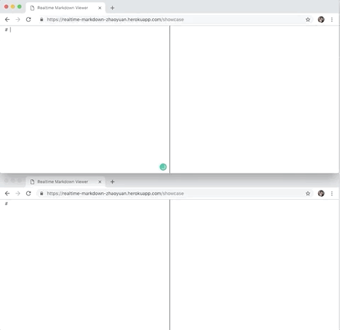

# Realtime Markdown (暂名）

A realtime [markdown](https://daringfireball.net/projects/markdown/) viewer/editor that supports multiple editors editing a workboard at same time. 

Try it at: https://realtime-markdown-zhaoyuan.herokuapp.com/

## Example Gif

## Sample Usage:
### General Instruction
Write something in markdown format on the left panel, and the html result will be shown in real time on the right panel.

#### Have something in mind?
Have something in mind or just want to examine your markdown format? Just use the url above to start a quick markdown writing.

#### Want to stay collaborative?
Each unique path is a collaborative workboard. Simply enter the same workboard url with your teammates, and all of you can start to contribute on one markdown file.  
(Each workboard associates with one *appurl+id*, try: https://realtime-markdown-zhaoyuan.herokuapp.com/sample-workboard)

## Future Plan
- [ ] pdf/html download link
- [ ] UI box to enter workboard id
- [ ] Narrow screen support (smartphone)
- [ ] Invitation links (たぶん)
- [ ] Show num of people in the workboard (たぶん)

## Disclaimer
* Please note that your workboard is **not private**, instead everyone who enters the same url can view and edit the content of it. 
* Please do **not** use this project to store any personal/credential information; since this project is still at **beta** stage, the security and permanency of your data is not guaranteed. 

## Special Thanks to
[Showdownjs](https://github.com/showdownjs/showdown) - A bidirectional Markdown to HTML to Markdown converter written in Javascript  
[Scotch](https://scotch.io/) - Top Shelf Web Development Training
